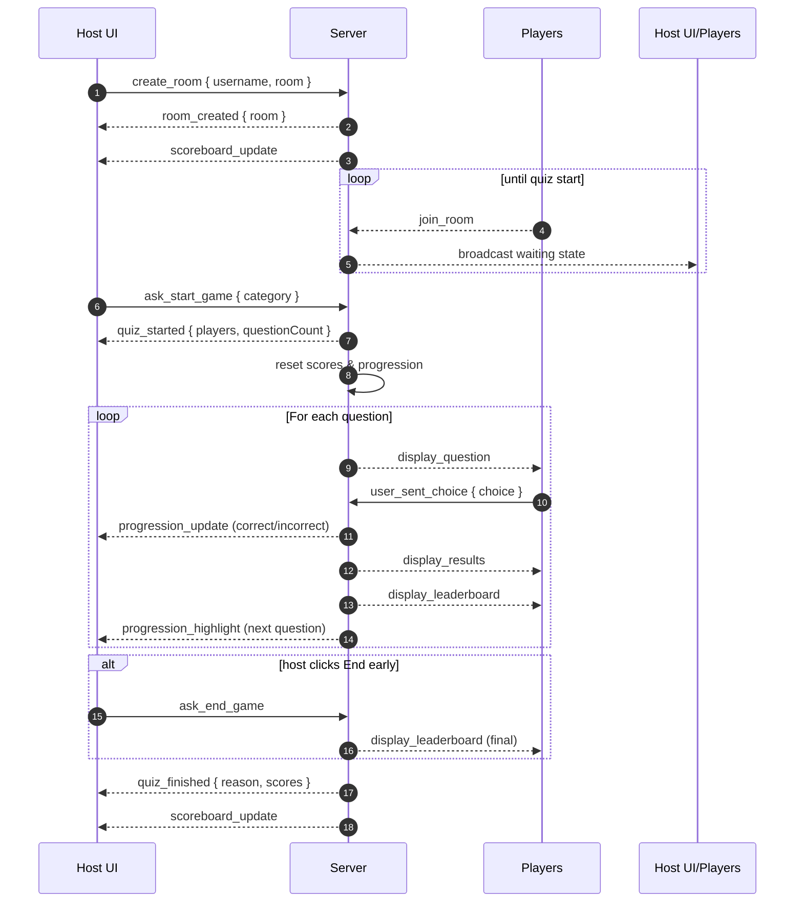
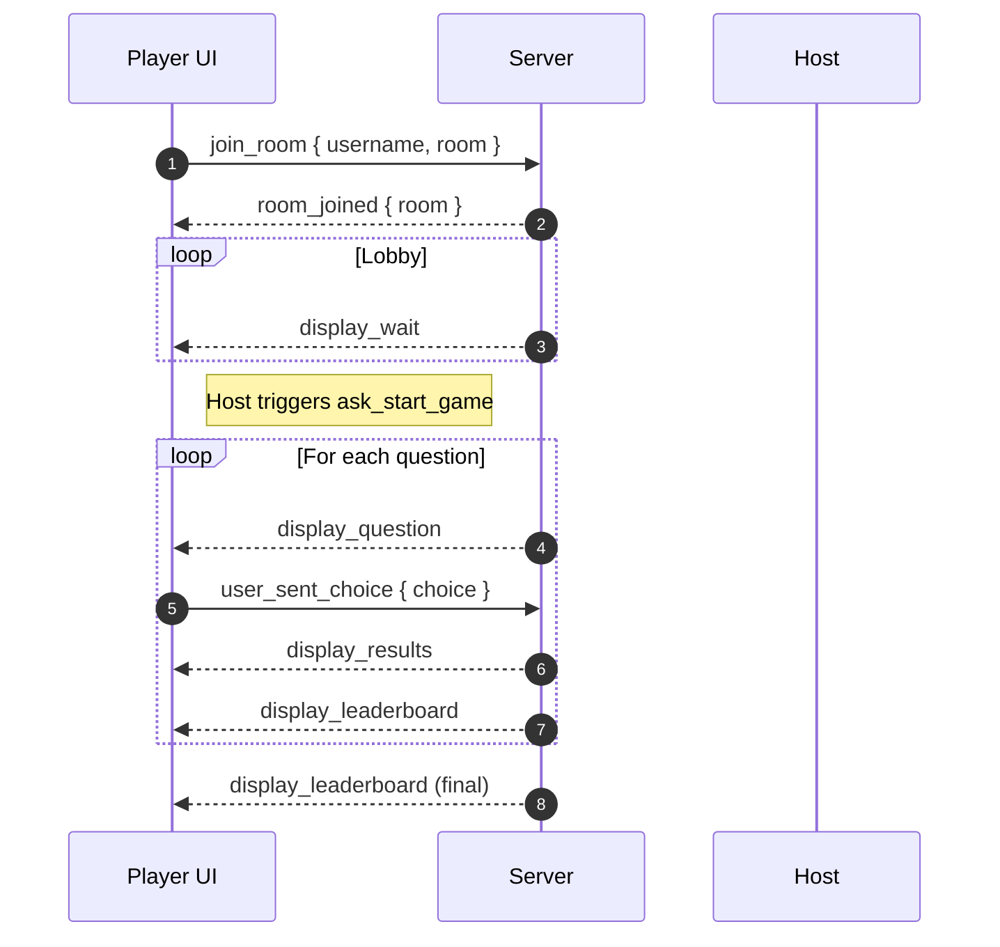

# Messaging Flow Overview

This document captures how the host and player clients interact with the server during the life of a quiz round. It focuses on Socket.IO events and the state transitions they trigger.

## Host Experience

### Narrative
1. **Creation** – The host invokes `create_room`. On success, the server acknowledges with `room_created` and begins sending `scoreboard_update`s whenever players join or scores change.
2. **Lobby** – Players joining the room trigger `join_room` on the server, which updates both the waiting panel (for players) and the host scoreboard.
3. **Start Quiz** – The host calls `ask_start_game`. The server validates there are players, resets scores, emits `quiz_started` (with the participant list and number of questions), and clears the progression table.
4. **Per Question Loop** – For each question, the server emits `display_question` to players, listens for `user_sent_choice`, evaluates correctness, updates scores, and sends `progression_update` + `progression_highlight` to the host. Players receive `display_results` and `display_leaderboard` alongside point totals.
5. **Ending** – If the host finishes early via `ask_end_game`, or after the last question, the server calls `finishQuiz`, pushing the final leaderboard to players, resetting the highlight (index `-1`), and notifying the host with `quiz_finished`.

## Player Experience

### Narrative
1. **Join** – The player sends `join_room`. Upon success, `room_joined` transitions them to the waiting screen.
2. **Waiting** – The player listens to `display_wait` updates showing the current roster while the host prepares.
3. **Quiz Loop** – For each question, `display_question` wakes the UI. The player responds via `user_sent_choice`, then sees the answer summary (`display_results`) followed by the leaderboard.
4. **Completion** – After the last question or an early end, `display_leaderboard` with `final: true` gives the closing standings.

## Accuracy Check
- **Creation Flow**: Verified against `create_room` handler in `src/server.ts`. The server sends `room_created`, `scoreboard_update`, and handles duplicate host joins by reassigning socket IDs. ✅
- **Start Logic**: `ask_start_game` resets scores (`reset_room_scores`), calls `initializeQuizState`, emits `quiz_started`, and refuses to start without players. ✅
- **Per Question Loop**: Observed in `runQuiz`, where `display_question`, `progression_highlight`, user answers, `progression_update`, `display_results`, and `display_leaderboard` are emitted. ✅
- **Finishing**: `finishQuiz` emits final leaderboard, resets highlight, and notifies host via `quiz_finished`. ✅
- **Player Loop**: Matches the events in `runQuiz` and the player-side listeners in `public/js/main.js`. ✅

The diagrams and explanations mirror current code behavior.
